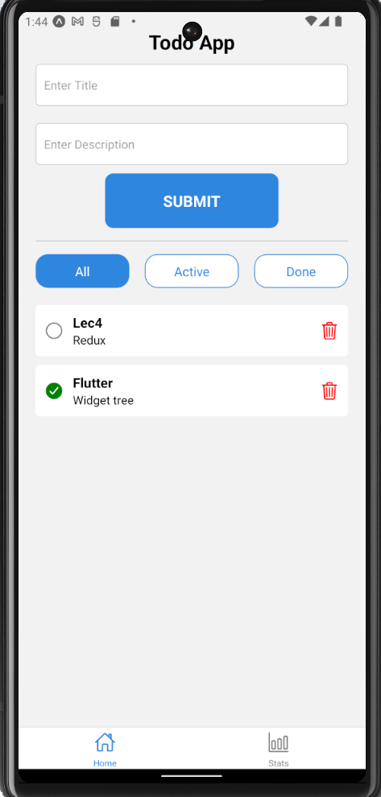
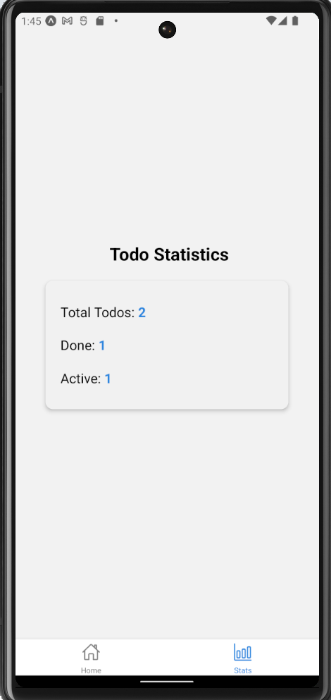

# Todo App with Redux & React Native

A **fully functional cross-platform Todo application** built with **React Native**, using **Redux Toolkit** for state management and **AsyncStorage** for local persistence. This project demonstrates clean architecture, modular component structure, and scalable Redux patterns.

## 📸 Screenshots

<div align="center">
  
  

## 🚀 Features

- ✅ **Add, toggle, and delete todos** with unique IDs
- 🔍 **Filter todos** by All / Active / Done status
- 📊 **Statistics screen** displaying total, active, and done count
- 💾 **State persistence** using AsyncStorage
- 🧭 **Navigation** using React Navigation with Bottom Tabs and Stack Navigator
- 🎨 **Modern UI components** with responsive design and accessible interactions
- 🔐 **Error-free unique ID generation** using `uuid` with `react-native-get-random-values`
- 📱 **Cross-platform compatibility** (iOS & Android)

## 🛠️ Technologies

- [React Native](https://reactnative.dev/)
- [Redux Toolkit](https://redux-toolkit.js.org/)
- [React Redux](https://react-redux.js.org/)
- [React Navigation](https://reactnavigation.org/)
- [AsyncStorage](https://react-native-async-storage.github.io/async-storage/)
- [UUID](https://github.com/uuidjs/uuid)
- [Expo](https://expo.dev/)

## 📁 Project Structure

```
├── App.js
├── app.json
├── index.js
├── package.json
├── /assets
│   ├── icon.png
│   ├── splash-icon.png
│   └── ...
├── /components
│   ├── TodoInput.js
│   ├── FilterBar.js
│   └── TodoList.js
├── /screens
│   ├── HomeScreen.js
│   └── StatisticsScreen.js
├── /redux
│   ├── store.js
│   └── todosSlice.js
└── /navigation
    └── index.js
```

## 📝 Installation

1️⃣ Clone the repository:

```bash
git clone https://github.com/ahmedgaafer1/reactnativeTask1/
cd your-repo-name
```

2️⃣ Install dependencies:

```bash
npm install --legacy-peer-deps
```

3️⃣ Install peer dependencies and polyfills:

```bash
npm install react-native-get-random-values
```

4️⃣ Run the app:

```bash
npx expo start
```

> **Note:** Use `npm install --legacy-peer-deps` if you encounter dependency conflicts.

## 💡 Usage

- Enter a todo title and description, then submit.
- Use filter buttons to switch between All / Active / Done.
- Navigate to the Statistics tab to view todo statistics.

## 🤝 Contributing

Pull requests are welcome. For major changes, please open an issue first to discuss potential updates.

## 📜 License

This project is open-source and available under the [MIT License](LICENSE).

---

Built with ❤️ by [Ahmed Mohamed Gaafer].
